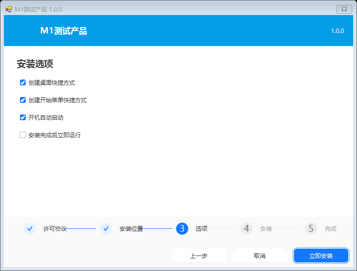

# xcool-install

**一个把整个程序目录打成单个 `.exe` 的 Windows 安装包制作工具。**
双语文案、按清单精确卸载、出错自动回滚。

> 这是对一个 2013 年的 WinForms + Delphi 安装包制作项目（`Installation` / `UnInstall` / `InstalltionEdit`）
> 的重写。旧项目仍在仓库里作为对照，见 [遗留项目](#遗留项目)。

---

## 它解决什么问题

旧工具能用，但有几个必须绕开的坑。下面是**实际代码位置**，不是泛泛而谈：

| 旧项目的问题 | 位置 |
|---|---|
| 用**按钮文字**当状态机，界面一翻译就失效 | `Installation\FrmInstallation.cs:173,218,78`、`UnInstall\FrmUnInstall.cs:117` |
| 解压时不校验路径，可被 `..\..\` 写到安装目录外 | `Installation\FrmInstallation.cs:725` |
| 卸载时**递归删光安装目录**，用户数据一起陪葬 | `UnInstall\FrmUnInstall.cs:232-257` |
| COM 注册先把 DLL 复制到 `System32`，参数还不加引号 | `Installation\FrmInstallation.cs:486-492` |
| 异常被空 `catch` 吞掉后照样打印"注册成功" | 同上 |
| 卸载键指向根本不存在的 `UnInstallation.exe` | `Installation\FrmInstallation.cs:587` |
| 制作机路径被打进发布包 | 实测真实包里的 `InstallSetupPath` / `InstallationExePath` |
| zip 条目名按当时区域 ANSI 代码页编码，跨语言乱码 | `CsharpZipLib\Zip\ZipConstants.cs:434` |

这些都在 [`项目分析报告.md`](项目分析报告.md) 里逐条列出了证据。

---

## 特性

### 打包端
- **单文件交付** —— 产物就是一个 `.exe`，没有附属目录、没有 `install.resources`
- **可重现构建** —— 同样的输入 + 同样的时间戳 = 同样的字节（e2e 里断言了两次打包哈希相同）
- **自校验容器** —— stub 哈希 + payload 哈希 + CRC32，回读验证失败就拒绝出包
- **图标补丁** —— 直接改 PE 资源目录，不依赖 `UpdateResource`
- **命令行可进 CI** —— `pack` / `verify` / `inspect` / `extract` / `diff`

### 安装端
- **十一步管线** —— 预检 → 结束占用进程 → 解压 → COM 注册 → 快捷方式 → 自启动 → 清理残留卸载项 → 标准卸载键 → 部署卸载器 → 写安装记录 → 装完运行
- **写前日志 + 整机回滚** —— 任何一步失败都回到安装前状态，不是"尽力而为"
- **按清单卸载** —— 只删自己装的文件，用户放进安装目录的东西保留
- **修复安装** —— `--repair` 按哈希逐个比对，只补缺失/损坏的，幂等
- **重复安装不留垃圾** —— 自动清理"同目录、不同 productCode"的残留卸载项
- **降级卸载** —— 安装记录丢了也能按卸载键定位并清理干净
- **COM 注册** —— 不复制到 `System32`、参数加引号、按目标位数选对 `regsvr32`、失败必须报错

### 界面
- **向导中英双语是默认行为** —— 内置 40+ 条中英文案，清单可逐条覆盖
- **制作端一屏三步** —— 只有 3 项必填：文件夹、产品名称、版本号
- **AntdUI 界面** —— 浅色/深色、主题色可配

---

## 快速上手

### 用现成的制作工具

```
制作工具\安装包制作助手.exe
```

> 该目录不在仓库里（是构建产物）。用 `tools\stage-tool.ps1` 生成，或见下面的"从源码构建"。

三步：

1. **选文件夹** —— 把要打包的程序目录拖进去
2. **填名称和版本** —— 中英文名可以只填一个
3. **点「生成安装包」**

模板 stub、输出路径、入口程序、安装目录、快捷方式名**全部自动推导**。
许可协议、安装范围、图标、COM 注册这些收在「高级选项」里。

### 从源码构建

需要 .NET SDK（能编译 `net48`）与 .NET Framework 4.8 Targeting Pack。

```powershell
dotnet build Installer.sln -c Release
powershell -ExecutionPolicy Bypass -File tools\e2e.ps1
```

### 命令行打包

```powershell
installer-cli pack --project app.wmpkg.json --source .\publish --stub Installer.Runtime.exe --out Setup.exe
installer-cli verify Setup.exe
installer-cli inspect Setup.exe
```

工程文件就是可读、可 diff 的 JSON：

```jsonc
{
  "schemaVersion": 2,
  "productCode": "{A4402741-6A0D-420B-93FC-2E1B8059E5E8}",
  "product": {
    "name": { "zh-Hans": "汽车小镇", "en": "Auto Town" },
    "version": "2.4.1"
  },
  "defaultInstallDir": "%LOCALAPPDATA%\\Programs\\AutoTown",
  "license": { "required": true, "text": { "zh-Hans": "…", "en": "…" } }
}
```

---

## 项目结构

```
Installer.sln
├── src/
│   ├── Installer.Abstractions/   契约层：清单模型、容器格式、步骤接口、平台接口
│   ├── Installer.Core/           实现层：打包、安装引擎、卸载引擎、PE 补丁、路径防护
│   ├── Installer.UI/             向导界面（AntdUI）
│   ├── Installer.Builder/        制作端界面（AntdUI）
│   ├── Installer.Cli/            命令行
│   └── Installer.Runtime/        安装端 stub（自包含单文件）
├── tests/Installer.Core.Tests/   182 项单元测试
├── tools/e2e.ps1                 168 项端到端断言，全程沙箱
└── docs/界面截图/                 界面渲染图
```

**分层规则**：`Abstractions ← Core ← {Cli, UI, Builder, Runtime}`，只允许单向依赖。
`Models/` 与 `Presenters/` 里没有 `using System.Windows.Forms;`，所以业务逻辑都能单测。

---

## 容器格式

```
[ PE stub ][ payload.zip ][ manifest.json ][ footer 128B ]
```

footer 放在**文件末尾**，PE 加载器会忽略尾部多余数据 —— 所以打包只需要"追加"，
不用 `UpdateResource`、不用回退 seek。

| 偏移 | 字段 |
|---|---|
| 0 | 魔数 `WMINS2\0\0` |
| 8 | 格式版本 |
| 16 / 24 | payload 偏移 / 长度 |
| 32 / 40 | manifest 偏移 / 长度 |
| 48 | payload SHA256 |
| 80 | **stub SHA256**（只哈希 payload 会漏掉代码篡改） |
| 112 | footer CRC32 |

规格的单一事实来源是 `Installer.Abstractions\Packaging\ContainerFormatSpec.cs`。

---

## 验收

| 项 | 结果 |
|---|---|
| 全解决方案构建（Debug / Release） | 0 警告 |
| 单元测试 | 182 / 182 |
| 端到端断言 | 168 / 168 |
| 真实系统残留 | 零（e2e 有专门的回归护栏） |

端到端覆盖：可重现构建、容器篡改检测、Zip Slip 防护、完整安装/卸载、
向导与制作端渲染、修复安装、v1 旧包迁移、指定安装位置、重复安装去重。

---

## 遗留项目

`Installation/` `UnInstall/` `InstalltionEdit/` `CsharpZipLib/` `CheckDotNet/` `DoNetFramework/`
是**旧项目原样保留**，只作对照，不参与构建。分析见：

- [`项目分析报告.md`](项目分析报告.md) —— 逐条列出旧代码的问题与证据
- [`打包逻辑对照.md`](打包逻辑对照.md) —— 新旧打包流程逐步对照
- [`重构方案.md`](重构方案.md) —— 重构设计
- [`重构说明.md`](重构说明.md) —— 已落地的实现与踩过的坑

---

## 界面




---

## 状态

已完成：打包 / 安装 / 卸载 / 向导 / 制作端 / COM 注册 / 修复安装 / v1 迁移。

未做：免注册 COM（明确报错，不假装成功）、标准静默参数 `/S` `/D=`、
外置 payload（差分更新）、制作端打开/保存工程按钮（命令行已支持）。
